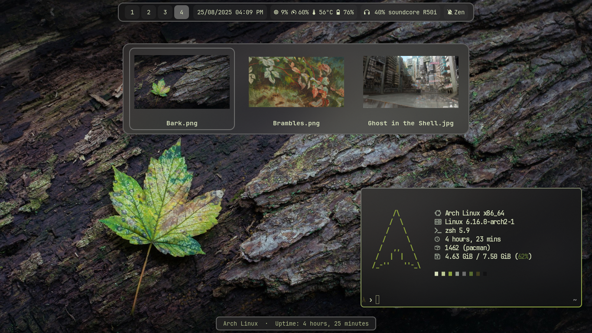

# Spn4x's Hyprland Dotfiles

A fully automated and cohesive desktop experience built on Hyprland, where the entire UI is dynamically themed from the wallpaper. This repository contains the complete configuration for my personal Arch Linux setup, including a suite of custom-built C widgets that form a complete desktop environment.

---

##  philosophy

This setup is built around the idea of a "living desktop"—an environment that is not only visually stunning but also deeply integrated and automated. The core principle is that a single action, changing the wallpaper, should trigger a cascade of updates that recolor and unify every component of the UI, from the window borders to the terminal to custom application widgets.

This is a "backyard mechanic's" approach to the desktop: if a tool didn't exist or didn't fit the aesthetic, I built it.

## Key Features

*   **Dynamic Theming:** Using **Wallust**, the entire 16-color palette is generated from the current wallpaper. A central management script then applies this theme to every configured application.
*   **Custom C Widgets:** The core of the experience. These are not just display items; they are fully-functional applications built from scratch to integrate seamlessly with the desktop:
    *   **Control Center:** Manages Wi-Fi, Bluetooth, audio sinks, brightness, and volume.
    *   **Hyper-Calendar & Schedule Widget:** A full calendar with CRUD (Create, Read, Update, Delete) functionality for managing events and schedules.
    *   **Side-MPRIS-Player:** A media player widget that displays metadata and features perfectly **synced lyrics** for music playing in any MPRIS-compatible player (including browsers).
*   **Centralized Management:** A single shell script (`manage.sh`) is used for my personal convenience to manage symlinks.
*   **Aesthetic Cohesion:** Every component, from the Ironbar status bar to the SwayNC notification daemon, is themed using a consistent set of CSS templates, ensuring a pixel-perfect, unified look and feel.

---

## Showcase

Here are a few videos demonstrating the setup in action.

| Live Widget Demo | Dynamic Theming in Action |
| :---: | :---: |
| [Video Link or GIF](vids/short-widget-demo-preview.mp4) | [Video Link or GIF](vids/theming-engine-preview.mp4) |

### Gallery

Detailed views of the custom widgets and the dynamic theming engine.

| MPRIS Player with Synced Lyrics | Control Center |
| :---: | :---: |
|  |  |
| **Calendar & Schedule** | **Dynamic Theme: Palette 1** |
|  |  |
| **Schedule Items** | **Dynamic Theme: Palette 2** |
|  |  |

---

## Core Components

This setup is built on a foundation of powerful and flexible open-source software.

*   **OS:** Arch Linux
*   **Window Manager:** [Hyprland](https://hyprland.org/)
*   **Theming Engine:** [Wallust](https://github.com/wallust-project/wallust)
*   **Status Bar:** [Ironbar](https://github.com/JakeStanger/ironbar)
*   **Wallpaper Daemon:** [swww](https://github.com/Horus645/swww)
*   **Terminal:** [Kitty](https://sw.kovidgoyal.net/kitty/)
*   **Notification Daemon:** [SwayNC](https://github.com/ErikReider/SwayNC)
*   **Custom Widgets:** Written in C using the GTK library.

---

## Installation and Usage

⚠️ **CRITICAL WARNING:** This is not a "theme" you can install. It is a snapshot of my live, heavily customized system. Attempting to apply these configurations directly **will break your desktop environment.**

These dotfiles are deeply intertwined with custom-compiled C applications, specific package versions, and hardcoded paths that are unique to my setup.

### How to Use This Repository (The Safe Way)

This repository is intended to be used for **inspiration and reference only.**

1.  **Browse the Code:** The best way to use this repo is to explore the configuration files for ideas. Find a component you like, such as the Ironbar config or the Hyprland animations.
2.  **Isolate and Understand:** Read through the configuration for that specific component. Understand what it does and identify any dependencies it has on my custom scripts or widgets.
3.  **Adapt and Adopt:** Manually copy the specific sections you find useful into your *own* personal configuration files. You **must** adapt the code by changing paths, removing dependencies, and adjusting settings to fit your own system.

**DO NOT run `manage.sh`.** This script is for my personal use to manage my own symlinks. It is not an installation script and it will not work on your system.

---

## Acknowledgments

This project would not be possible without the incredible work of the developers behind Hyprland, Wallust, and the entire Linux FOSS community. Thank you for providing the tools that allow for such deep and meaningful customization.

---

## License

This project is licensed under the [MIT License](LICENSE). Feel free to use and modify the code as you see fit.